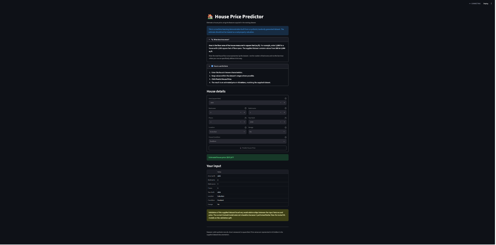

# 🏠 House Price Prediction Model

A complete machine-learning house price prediction project built from the supplied 2,000-row dataset.

## 📸 Application Screenshot

The Streamlit interface guides the user through the house characteristics, explains how **Area** is measured, provides the expected dataset ranges, and gives a clear warning that the estimate is for demonstration purposes.



## 1. Objective

Predict `Price` from these house characteristics:

- `Area` — **house floor area in square feet (sq ft)**
- `Bedrooms`
- `Bathrooms`
- `Floors`
- `YearBuilt`
- `Location`
- `Condition`
- `Garage`

`Price` is the target variable. `Id` is excluded because it is only an identifier.

## 2. Dataset ranges used by the UI

| Feature | Dataset range | Meaning |
|---|---:|---|
| Area | 500–5,000 sq ft | House floor area |
| Bedrooms | 1–5 | Number of bedrooms |
| Bathrooms | 1–4 | Number of bathrooms |
| Floors | 1–3 | Number of floors |
| Year Built | 1900–2023 | Construction year |
| Location | Downtown / Urban / Suburban / Rural | Location category |
| Condition | Excellent / Good / Fair / Poor | Current condition |
| Garage | Yes / No | Garage availability |
| Price | $50,000–$1,000,000 | Target price in supplied dataset |

## 3. Training pipeline

`src/train.py`:

1. Loads and validates `data/houses.csv`.
2. Splits the data into 80% training and 20% validation data using `random_state=42`.
3. Handles numeric and categorical preprocessing.
4. Trains Ridge, Random Forest, Gradient Boosting, and a mean baseline.
5. Selects the model with the lowest validation MAE.
6. Retrains the selected pipeline on all 2,000 records.
7. Generates `models/house_price_model.joblib`.
8. Generates `models/metrics.json`.
9. Writes a complete readable training report to `training_output.txt` every time the script is run.

### Important result from this dataset

The supplied dataset is described as randomly generated. Validation showed that the mean baseline performed slightly better than the tested ML models, so the selected model is currently a baseline predictor rather than a complex ML model. This is documented rather than hidden.

## 4. Streamlit UI

Run:

```powershell
streamlit run app.py
```

The interface explains that `Area` means **house floor area in square feet**, shows the dataset's expected ranges, provides input help text, and clearly states that the result is a demonstration rather than a real-world valuation.

## 5. Training and testing

### Windows PowerShell

```powershell
cd house_price_prediction
python -m venv .venv
.\.venv\Scripts\Activate.ps1
pip install -r requirements.txt
python src/train.py
pytest -q
streamlit run app.py
```

If PowerShell blocks activation:

```powershell
Set-ExecutionPolicy -Scope Process Bypass
.\.venv\Scripts\Activate.ps1
```

### Generated files

After training:

```text
training_output.txt
models/house_price_model.joblib
models/metrics.json
```

After testing with `pytest -q`:

```text
test_output.txt
```

`test_output.txt` is generated automatically by `tests/conftest.py`, so running the normal command `pytest -q` is enough.

## 6. Example CLI prediction

```powershell
python src/predict.py --area 2000 --bedrooms 3 --bathrooms 2 --floors 2 --year-built 2000 --location Suburban --condition Good --garage Yes
```

## 7. Future improvement

For a real estate valuation system, add real-world features such as neighbourhood/GPS location, land size, property type, distances to amenities, parking capacity, security, furnishing, listing/sale date, and comparable transaction prices.
